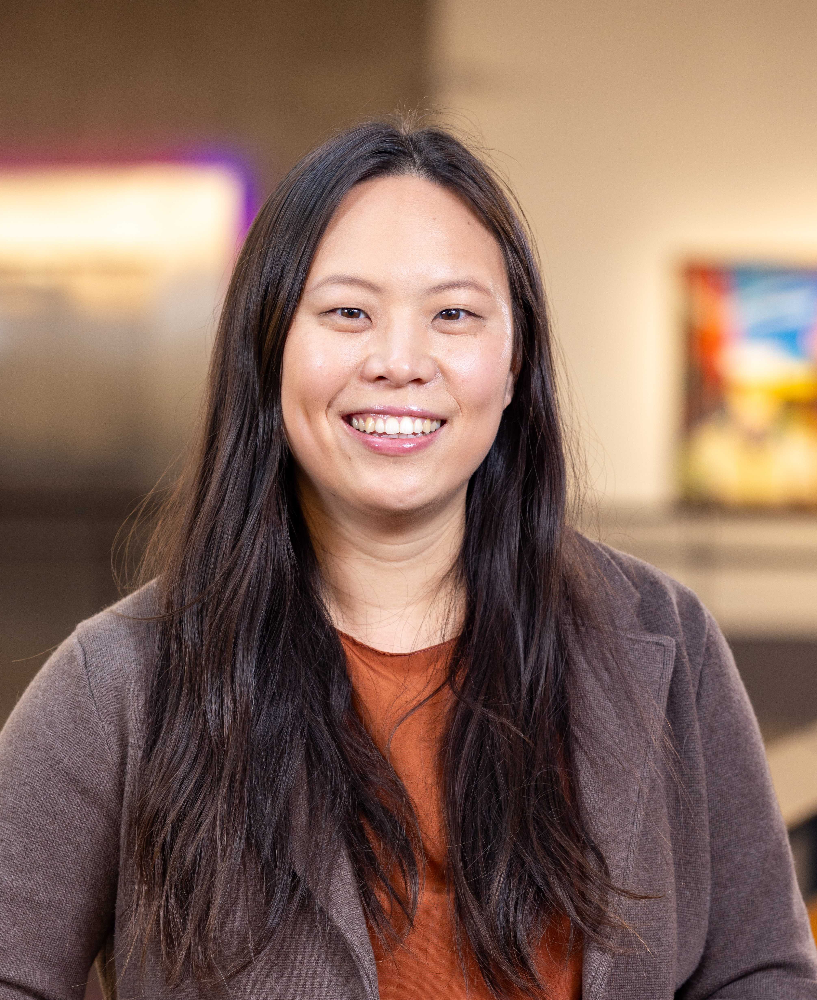

# Northwest Database Society (NWDS) Annual Meeting 2025

### **Where**:

[Bill & Melinda Gates Center For Computer Science & Engineering](https://www.washington.edu/maps/#!/cse2)

Zillow Conference Center (on the top floor of the building)

University of Washington

3800 E Stevens Way NE

Seattle, WA 98195

[Parking information](https://facilities.uw.edu/transportation/park): We recommend using self-parking in [Padelford (lots N-20 and N-21)](https://transportation.uw.edu/park/visitor/self-serve). Please plan 20-min to park and walk to the building. Most of the time, there is no one at the gate, so proceed directly to self-parking.

Wifi will be available to participants.

### **When**:

Friday, February 7th, 8:30am - 4:30pm.

### **Description**:

The Northwest Database Society Annual Meeting brings together researchers and practitioners from the greater Pacific Northwest for a day of technical talks and networking on the broad topic of data management systems.

### **Invited Talk 1: "The Streaming Batch Model for Efficient and Fault-Tolerant Heterogeneous Execution," Stephanie Wang (UW Allen School)**

> While ML model training and inference are both GPU-intensive, CPU-based data processing is often the bottleneck. Distributed data processing systems based on the batch or stream processing models excel at CPU-based computation but either under-utilize the heterogeneous resources common in ML pipelines or impose high overheads on failure and reconfiguration. In this talk, I'll introduce the streaming batch model, a hybrid of the two models that enables efficient and fault-tolerant heterogeneous execution. The key idea is to execute one partition at a time to allow lineage-based recovery with dynamic resource allocation. This enables memory-efficient pipelining across heterogeneous resources, similar to stream processing, but also offers the elasticity and fault tolerance properties of batch processing. I'll present Ray Data, an implementation of the streaming batch model that improves throughput on heterogeneous batch inference pipelines by 3–8 compared to traditional batch and stream processing systems. When training Stable Diffusion, Ray Data matches the throughput of single-node ML data loaders while additionally leveraging distributed heterogeneous clusters to further improve training throughput by 31%.

    

        <a href='https://stephanie-wang.github.io/'>
            
            
Stephanie Wang

        </a>
    

    

    Stephanie is an assistant professor at University of Washington, a creator of the open-source project Ray, and a founding engineer at Anyscale. Previously, she completed her PhD at UC Berkeley. Her research is in distributed systems, cloud computing, and systems for machine learning and data. Previous projects include Exoshuffle, which broke the Cloudsort record for cost-efficient distributed sort, and Ray Core, the distributed compute engine that was used to train GPT-4.
    

### **Invited Talk 2: "Scalable OLTP in the Cloud: What's the BIG DEAL?," Pat Helland (Salesforce)**

> The pursuit of scalable OLTP systems has been the holy grail of my career. Because OLTP systems are typically split into applications and databases, the isolation semantics provided by the DB and used by the app have a major impact on the scalability of the OLTP system as a whole. The isolation semantics are a BIG DEAL!
>
> This thought experiment explores the asymptotic limits to scale for OLTP systems. An OLTP (OnLine Transaction Processing) system is a domain-specific application using a RCSI (READ COMMITTED SNAPSHOT ISOLATION) SQL database to provide transactions across many concurrent users. This interface provides the contractual BIG DEAL between OLTP databases and OLTP applications.
>
> Focusing on the BIG DEAL, shows today’s popular databases unnecessarily limit scale. Similarly, we identify common app patterns that inhibit scale. We can reimagine the way we build both databases and applications to empower scale. All while complying with the established SQL and RCSI interface (i.e., the BIG DEAL).
>
> Perhaps, this can provoke discussions within the database community leading to new opportunities for OLTP systems. To me, that would be a big deal!
>
> This talk covers the content in my CIDR 2024 paper "Scalable OLTP in the Cloud: What's the BIG DEAL?".

    

        <a href=''>
            
            
Pat Helland

        </a>
    

    

    Pat Helland has been building distributed systems and databases since 1978 at companies including Tandem, Microsoft, and Amazon.  He is constantly curious about emerging trends in technology and their implications on systems.  He loves writing papers that challenge prevailing beliefs.  Pat has been working on database technology at Salesforce since 2012.
    

### **Agenda**:

**&nbsp;&nbsp;8:30 am&emsp;** Coffee/tea

**&nbsp;&nbsp;9:00 am&emsp;** Invited Talk 1: "The Streaming Batch Model for Efficient and Fault-Tolerant Heterogeneous Execution," Stephanie Wang (UW Allen School)

**&nbsp;&nbsp;9:45 am&emsp;** Session 1 - Vector Databases

* "Vector Search for Retrieval," Bailu Ding (Microsoft Research)
* "Intelligent index selection for Vector Databases," Artur Borycki (Teradata)
* "Supporting Vector Search in Relational Databases for Advanced RAGs," Jianguo Wang (Purdue University)
* "Scalable Indexing and Text/Vector Search Infrastructure in BigQuery," Omid Fatemieh (Google)

**10:45 am&emsp;** BREAK

**11:15 am&emsp;** Panel - Graph Data Management (Chaired by Leilani Battle)

Panelists:
* Umit Catalyurek (AWS & Georgia Tech)
* Luna Dong (Meta Reality Labs)
* Andrew Lumsdaine (RelationalAI/PNNL/UW)
* Ameya Patil (University of Washington)
* Raja Ravipati (Microsoft)

**12:15 pm&emsp;** Lunch with posters

**&nbsp;&nbsp;1:30 pm&emsp;** Invited Talk 2: "Scalable OLTP in the Cloud: What's the BIG DEAL?," Pat Helland (Salesforce)

**&nbsp;&nbsp;2:15 pm&emsp;** Session 2 - DB+LLMs

* "Post-train LLMs for higher factuality," Luna Dong (Meta)
* "Vortex: Combined Storage and Runtime for RAG LLM systems," Ken Birman (Cornell University)
* "Learning on Dirty Data, Inference on Dirty Models," Arash Termehchy (Oregon State University)
* "GenAI in BigQuery ML: What's New and Exciting?," Xi Cheng (Google)

**&nbsp;&nbsp;3:15 pm&emsp;** BREAK

**&nbsp;&nbsp;3:45 pm&emsp;** Session 3 - Potpourri

* "Innovations in AWS Analytics," Sudipto Das (AWS)
* "DDS: DPU-optimized Disaggregated Storage," Phil Bernstein (Microsoft Research)
* "Test Database Generation for Text-to-SQL Evaluation and Beyond," Zhengjie Miao (Simon Fraser University)

**&nbsp;&nbsp;4:30 pm&emsp;** EVENT ENDS

### **Accommodations**:

The following are suggested hotels near the University of Washington.
Please contact them for further information.

[Silver Cloud](https://www.silvercloud.com/university/)

[Marriott Residence Inn](https://www.marriott.com/en-us/hotels/seaud-residence-inn-seattle-university-district/overview/)

[University Inn](https://www.staypineapple.com/university-inn-seattle-wa)

[Watertown Hotel](https://www.staypineapple.com/watertown-hotel-seattle-wa)

[Graduate Seattle](https://www.graduatehotels.com/seattle/) (formerly the Hotel Deca)

### **Contact Information**:

[Prof. Magdalena Balazinska](https://www.cs.washington.edu/people/faculty/magda)

[Prof. Leilani Battle](https://homes.cs.washington.edu/~leibatt/bio.html)

[Prof. Dan Suciu](https://homes.cs.washington.edu/~suciu/)

### **Sponsors**:

We thank the UWDB industry affiliate partners for supporting this event.

* Amazon
* Google
* Microsoft
* MotherDuck
* Numbers Station
* Snowflake
* Teradata
* Western Digital
