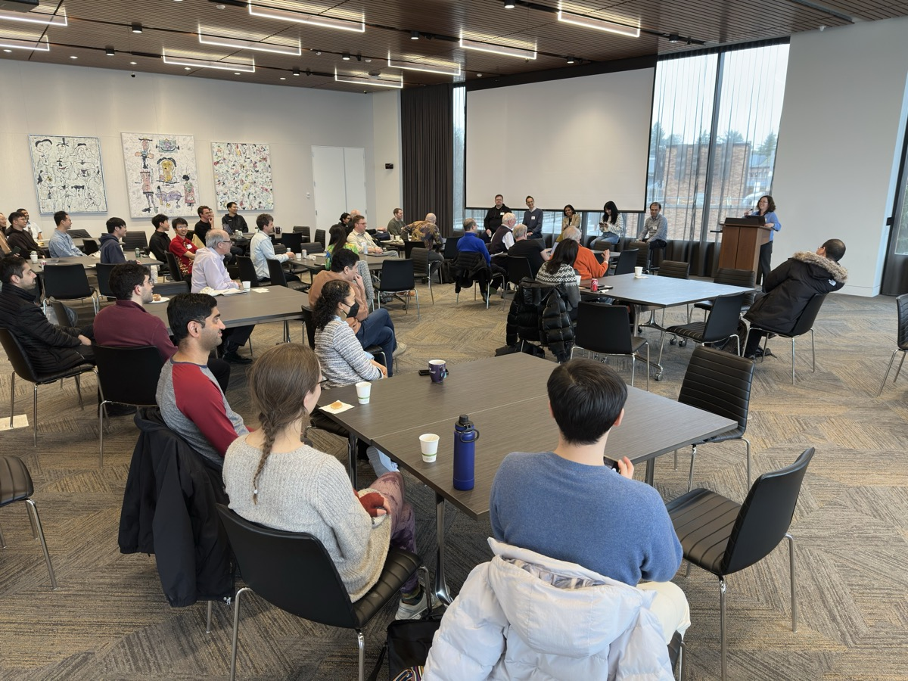
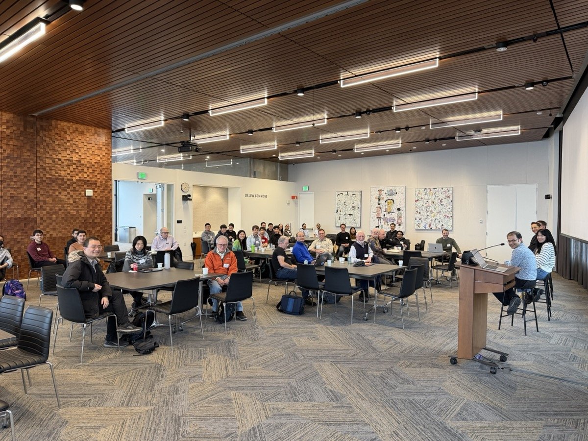
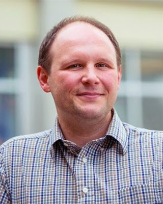

# Northwest Database Society (NWDS) Annual Meeting 2026

## **Where**:

[Bill &amp; Melinda Gates Center For Computer Science &amp; Engineering](https://www.washington.edu/maps/#!/cse2)

Zillow Commons (4th floor)

University of Washington

3800 E Stevens Way NE

Seattle, WA 98195-2355

[Parking information](https://transportation.uw.edu/park/visitor): (we recommend using the self parking option on Padelford - N20 and N21). Please plan 20 min to park and walk to the Gates Center.

Wifi will be available to participants.

## **When**:

Friday, March 13th, 9:00am - 4:30pm.

## **Description**:

The Northwest Database Society Annual Meeting brings together researchers and practitioners from the greater Pacific Northwest for a day of technical talks and networking on the broad topic of data management systems.

  
  

## **Keynote: "Relational Equality Saturation: E-graphs Meet Query Engines," Zachary Tatlock (UW Allen School)**

> Equality saturation (EqSat) has emerged as a practical way to do rule-based optimization and reasoning in compilers, theorem provers, and even query optimizers. Instead of relying on delicate rewrite scheduling heuristics, EqSat approximates applying "all rewrites in every order" by using e-graphs to represent a large equivalence class of expressions compactly, then performs cost-based extraction to pick the best version.
>
> This talk will explore how treating EqSat as a data management problem has made this technique a hot topic in the PL world and beyond. A central bottleneck in EqSat is "e-matching": finding all substitutions that make a rewrite pattern match some term in the current e-graph. We show that e-matching is naturally equivalent to evaluating conjunctive queries over a relational encoding of the e-graph. This perspective enables (i) asymptotically better matching via database join algorithms (including worst-case–optimal joins), (ii) principled data-complexity guarantees, and (iii) new "multi-pattern" and merge-only rule forms that are awkward in traditional e-graph engines.
>
> Building on this connection, we developed egglog, which treats EqSat as "Datalog + congruence." Congruence becomes a functional-dependency invariant; saturation becomes fixpoint evaluation; and analyses/guards become functions with user-defined merges. This unifies rewriting, analysis, and incremental maintenance under one rule engine, while leveraging classic Datalog ideas such as semi-naive evaluation.
>
> We will survey some of the many projects using EqSat to achieve state-of-the-art results in compilers, hardware design, computation fabrication, and more. Finally we'll close with some current challenges and next steps for DB-inspired EqSat engines going forward.

    

        <a href='https://www.cs.washington.edu/people/faculty/zachary-tatlock/'>
            
            
Zachary Tatlock

        </a>
    

    
 Professor Zachary Tatlock's research interests include compilers, term rewriting, numerics, formal verification, and computational fabrication. Outside of the lab, he helps organize the running club, attempts small knitting projects, and practices cooking vegan food. He can juggle and solve Rubik's cubes, but not at the same time. 
    
      
    
    Tatlock spent six sunny years at UC San Diego working on his Ph.D. with his incredible advisor Sorin Lerner. Throughout grad school, Sorin set a stellar example of how remarkable doing research can be when you put students first, an example Tatlock strives to emulate. He also learned many invaluable lessons from the great Ranjit Jhala, especially when it comes to writing and presentation: less is more!
    
      
    
    He graduated from Purdue University in Spring 2007 with degrees in Computer Science and Mathematics. As an undergraduate, he was fortunate to work with Suresh Jagannathan on the SML compiler MLton. For their Honors Project, advised by Antony Hosking, Tatlock and his good friend Bill Harris designed and implemented a domain specific language to control a giant neon sculpture over the web. He also ran the lab component of Purdue's introductory Java programming course for three years.

## **Agenda**:

**&nbsp;&nbsp;8:30 am&emsp;** Coffee/tea

**&nbsp;&nbsp;9:00 am&emsp;** Welcome (Magda Balazinska)

**&nbsp;&nbsp;9:05 am&emsp;** Keynote: "Relational Equality Saturation: E-graphs Meet Query Engines," Zachary Tatlock (UW Allen School) <!-- [(slides)](slides/tatlock-keynote.pdf) --> (Session chair: Dan Suciu)

**10:00 am&emsp;** BREAK

**10:30 am&emsp;** Session 1 (Session chair: Leilani Battle)

* "Avoiding Thread Stalls and Switches in Key-Value Stores: New Latch-Free Techniques and More," David Lomet [(slides)](slides/lomet.pdf)
* "I Can't Believe It's Not Yannakakis: Pragmatic Bitmap Filters in Microsoft SQL Server," Hangdong Zhao (Microsoft) [(slides)](slides/zhao.pdf)
* "Scaling Datalog on GPU," Yihao Sun (Syracuse University) [(slides)](slides/sun.pdf)
* "KalDB: A Polystore for Search and Analytics Workloads," Suman Karumuri (KalDB) <!-- [(slides)](slides/karumuri.pdf) -->
* "Querying with Conflict of Interest," Arash Termehchy (Oregon State University) <!-- [(slides)](slides/termehchy.pdf) -->
* "Progress Indication for Deep Learning Model Training," Gang Luo (School of Medicine, UW) [(slides)](slides/luo.pdf)

**12:00 pm&emsp;** Lunch with posters

**&nbsp;&nbsp;1:30 pm&emsp;** Session 2 (Session chair: Dan Suciu)

* "From Sight to Insight: Visual Memory for Smarter Assistants," Luna Dong (Meta) <!-- [(slides)](slides/dong.pdf) -->
* "What's New in BigQuery AI/ML," Xi Cheng (Google) [(slides)](slides/cheng.pdf)
* "Snowflake Semantic View: Unlocking Efficient and Trusted AI-powered BI," Evelyn Li and Tian Gao (Snowflake) <!-- [(slides)](slides/li-gao.pdf) -->
* "What Does Responsible AI Mean? A Cross-Area Perspective," Leilani Battle (Allen School, UW) <!-- [(slides)](slides/battle.pdf) -->
* "TraversRL: Reinforcement Learning for Urban Data Repair," Bill Howe (Information School, UW) <!-- [(slides)](slides/howe.pdf) -->

**&nbsp;&nbsp;3:00 pm&emsp;** BREAK

**&nbsp;&nbsp;3:30 pm&emsp;** Panel: "Agentic AI And Data Management" (Session chair: Magda Balazinska)

* Hossein Ahmadi (Snowflake)
* Sudipto Das (Databricks)
* Jenny Ortiz (Google)
* Vidya Setlur (Tableau Research)
* Markus Weimer (Microsoft)

**&nbsp;&nbsp;4:30 pm&emsp;** EVENT ENDS

## **Accommodations**:

The following are suggested hotels near the University of Washington.
Please contact them for further information.

[Silver Cloud](https://www.silvercloud.com/university/)

[Marriott Residence Inn](https://www.marriott.com/en-us/hotels/seaud-residence-inn-seattle-university-district/overview/)

[University Inn](https://www.staypineapple.com/university-inn-seattle-wa)

[Watertown Hotel](https://www.staypineapple.com/watertown-hotel-seattle-wa)

[Graduate Seattle](https://www.hilton.com/en/hotels/seagsgu-graduate-seattle/) (formerly the Hotel Deca)

## **Contact Information**:

[Prof. Magdalena Balazinska](https://www.cs.washington.edu/people/faculty/magda)

[Prof. Leilani Battle](https://homes.cs.washington.edu/~leibatt/bio.html)

[Prof. Dan Suciu](https://homes.cs.washington.edu/~suciu/)

## **Sponsors**:

We thank the UWDB industry affiliate partners for supporting this event.

* Amazon
* Google
* Microsoft
* MotherDuck
* Numbers Station
* Snowflake
* Teradata
* Western Digital

## **Previous Meetings**:

This is the ninth meeting of the series. Previous meetings were held at:

* [2025 University of Washington](/events/database_day/2025/database_day_2025.html)
* [2024 Google](https://sites.google.com/view/nwds-2024/home)
* [2023 Microsoft Research](https://www.microsoft.com/en-us/research/event/northwest-database-society-nwds-annual-meeting-2023/)
* [2022 Meta](https://research.facebook.com/2022-northwest-database-society-annual-meeting/)
* [2021 University of Washington (Virtual)](https://sites.google.com/view/nwds2021/home)
* [2020 Amazon/Google (Virtual)](https://sites.google.com/view/pnw-db-society-event/home)
* [2019 Microsoft Research](https://www.microsoft.com/en-us/research/event/northwest-database-society-nwds-annual-meeting-2019)
* [2018 University of Washington](/events/database_day/2018/database_day_2018.html)
