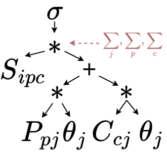

# Sparse Tensor Optimization

  
  
Galley: Modern Query Optimization for Sparse Tensor Programs

  

  	<a class="btn btn-primary btn-lg label-primary" href="https://arxiv.org/pdf/2408.14706" role="button" style="width: 220px;">Read the Paper <small>&nbsp;</small></a>
  	<a class="btn btn-primary btn-lg label-primary" href="https://github.com/finch-tensor/Finch.jl" role="button" style="width: 220px;">Explore the Code <small>&nbsp;</small></a>
  

## About The Project
Sparse tensor programming is an emerging paradigm that attempts to generalize the highly productive tensor programming framework to a wider array of workloads. While this provides new benefits for users, it also opens up new challenges in program optimization. Sparse programs are significantly more challenging to optimize than dense programs, and their optimal form depends on the input data. Fortunately, the database community has been struggling with very similar problems for decades and has built a robust set of techniques and intuition. This project aims to bring that expertise to sparse tensor programming by building a program optimizer, named Galley, on top of the Finch compiler. 

### Acknowledgments
This work was supported by NSF SHF 2312195 and NSF IIS 2314527.
